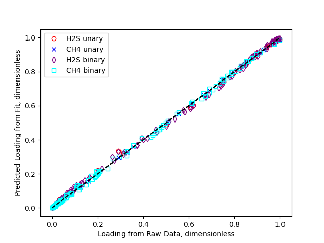

# adsorption_isotherm_fitting
Fit temperature-dependent isotherms to equilibrium data.

# Getting Started

[Documentation](https://adsorption-isotherm-fitting.readthedocs.io/en/latest/)

Installation
============
coming soon

Examples
========

H2S/CH4 on MFI Zeolite
----------------------

Fit temperature-dependent Langmuir unary and binary isotherms for H2S/CH4 mixture isotherms [^1].

Example script [here](examples/h2s_ch4.py)

    

[^1]: Shah, MS; Tsapatsis, M; and Siepmann, JI. “Monte Carlo Simulations Probing the Adsorptive Separation of Hydrogen Sulfide/Methane Mixtures Using All-Silica Zeolites.” 2015. Langmuir 31: 12268–78. doi:10.1021/acs.langmuir.5b03015.

# See Also
[PyGAPS](https://github.com/pauliacomi/pyGAPS)
[PyIAST](https://github.com/CorySimon/pyIAST)

