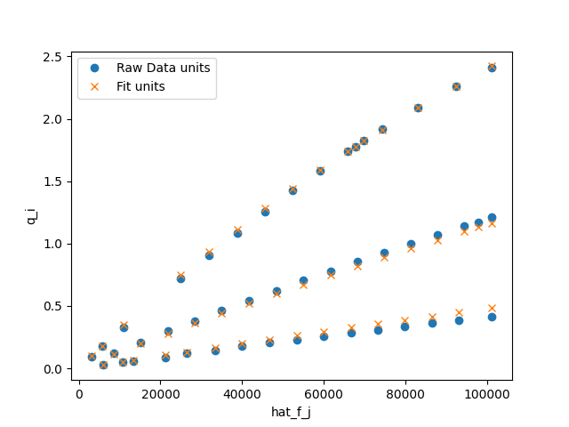
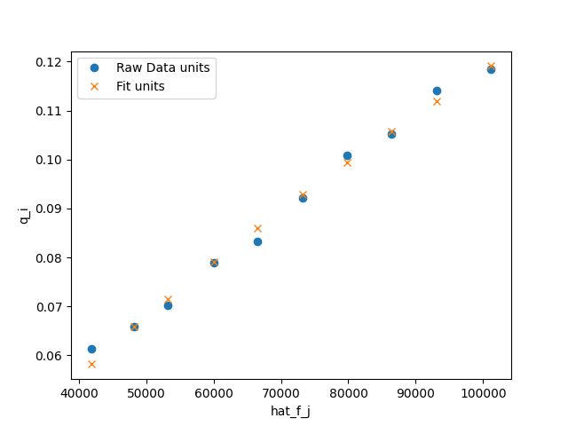

CO2/N2 Unary Example
=====================

In this example, we fit temperature-dependent unary data
from :cite:`Pham2014`.

Initialization
--------------

We first load the necessary packages

>>> import pyomo.environ as pyo
>>> import matplotlib.pyplot as plt
>>> import pandas as pd
>>> from isotherm_models.unaryisotherm import LangmuirUnary

CO2
---

We first get the data from the data file

>>> data = pd.read_csv('data_sets/CO2_BEA.csv')

Using pandas, we can easily take a peek at the data we have input from our .csv file

>>> data.head()
    P [atm]  Q [mmol/g]  T [K] adsorbate
0  0.029814    0.096491  273.0       CO2
1  0.055856    0.175439  273.0       CO2
2  0.109177    0.328947  273.0       CO2
3  0.246821    0.719298  273.0       CO2
4  0.313781    0.903509  273.0       CO2

Before solving the model, we convert the partial pressures to si units

>>> P_i = data['P [atm]']*101325  # convert to Pa -- si units

so that we can create the model

>>> co2_model = LangmuirUnary(P_i, data['Q [mmol/g]'], data['T [K]'], name='CO2')

and solve it

>>> co2_model.solve()

We then take a look at the results

>>> co2_model.get_R2_pyomo()
0.99796
>>> co2_model.get_objective()
0.007229102
>>> co2_model.dH_i.display()
dH_i : Size=1
    Key  : Value
    None : -20780.90809523844
>>> co2_model.q_mi.display()
q_mi : Size=1
    Key  : Value
    None : 8.95582798469325
>>> co2_model.k_i_inf.display()
k_i_inf : Size=1
    Key  : Value
    None : 3.8656918601559114e-10

And save the results to a file

>>> fig = plt.figure()
>>> fig, ax = co2_model.plot_unary(fig=fig)
>>> _ = ax.legend()
>>> fig.savefig('docs/source/CO2_example.png')

which looks like

N2
--

We repeat a similar approach for the N2 isotherms,
first formatting the data for input to the model

>>> data = pd.read_csv('data_sets/N2_BEA.csv')

Using pandas, we can easily take a peek at the data we have input from our .csv file

>>> data.head()
    P [atm]  Q [mmol/g]  T [K] adsorbate
0  0.525470    0.070175  303.0        N2
1  0.592387    0.078947  303.0        N2
2  0.656824    0.083333  303.0        N2
3  0.722502    0.092105  303.0        N2
4  0.788179    0.100877  303.0        N2

Before solving the model, we convert the partial pressures to si units

>>> P_i = data['P [atm]']*101325  # convert to Pa -- si units

Instantiating (creating) the model

>>> n2_model = LangmuirUnary(P_i, data['Q [mmol/g]'], data['T [K]'], name='N2')

Solving it

>>> n2_model.solve()

We then take a look at the results

>>> n2_model.get_R2_pyomo()
0.99262
>>> n2_model.get_objective()
0.00194249
>>> n2_model.dH_i.display()
dH_i : Size=1
    Key  : Value
    None : -12557.526993112784
>>> n2_model.q_mi.display()
q_mi : Size=1
    Key  : Value
    None : 0.45280441671269905
>>> n2_model.k_i_inf.display()
k_i_inf : Size=1
    Key  : Value
    None : 2.412336128388879e-08

And save the results to a file

>>> fig = plt.figure()
>>> fig, ax = n2_model.plot_unary(fig=fig)
>>> _ = ax.legend()
>>> fig.savefig('docs/source/N2_example.png')

which looks like

Comparison to scipy
-------------------

>>> import numpy as np
>>> popt, pcov = co2_model.solve_scipy()
>>> popt
array([  3.71939309, -10.14817759,  -7.28715595])
>>> popt - np.array(list(map(pyo.value, [co2_model.q_mi_star, co2_model.A_i, co2_model.H_i_star])))
array([3.28355311e-05, 3.67969745e-05, 3.88858220e-05])
