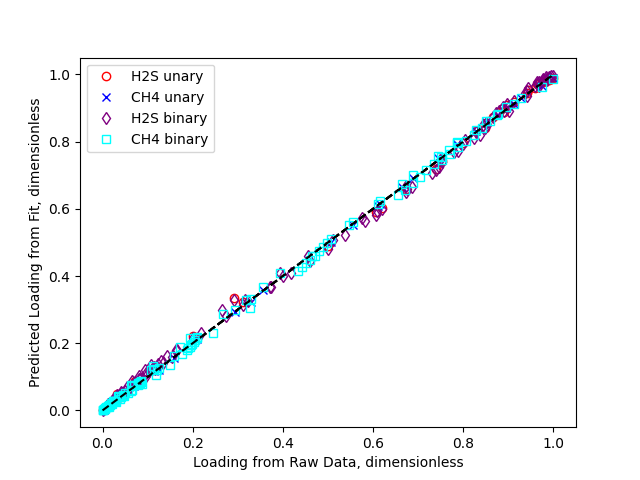

H2S/CH4 Example
===============

In this example, we fit temperature-dependent binary data
from :cite:`Shah2015` and compare the results to using the extended Langmuir combining rule.

Initialization
--------------

First, we import the necessary packages

>>> import pyomo.environ as pyo
>>> import matplotlib.pyplot as plt
>>> import pandas as pd
>>> from isotherm_models.unaryisotherm import LangmuirUnary
>>> from isotherm_models.binaryisotherm import BinaryLangmuir

First, we grab the data for adsorption of H2S:

>>> df = pd.read_csv('data_sets/CH4_H2S_MFI_binary_with_fugacity.csv')
>>> hat_f_i, hat_f_j, q_i, T = df['fugacity H2S [Pa]'], df['fugacity CH4 [Pa]'], df['Q H2S [mmol/g]'], df['T [K]']

Here, we are going to fit the loading of H2S, :code:`q_i`, as a function of the (mixture)
fugacities of H2S, :code:`hat_f_i`, and CH4, :code:`hat_f_j`.
Since the data file includes both binary and unary data (including CH4 unary data where H2S is not present),
we need to find the data points where H2S is present.
We can do this with a list comprehension as below

>>> all_points = [i for i in range(len(q_i)) if q_i[i] > 0.]

Now, we can create a model with all of these points. We choose the :class:`.isotherm_models.binaryisotherm.BinaryLangmuir` model.

>>> h2s_binary = BinaryLangmuir(
...     [hat_f_i[i] for i in all_points],
...     [hat_f_j[i] for i in all_points],
...     [q_i[i] for i in all_points],
...     [T[i] for i in all_points],
...     name='H2S_binary'
... )

Similarly, we can find the indices of points where *only* H2S is present (i.e., the unary points for H2S),
using the following code

>>> unary_points = [i for i in range(len(q_i)) if hat_f_j[i] < 1e-12]
>>> f_i = [hat_f_i[i] for i in unary_points]

And we can create a unary model as

>>> h2s_unary = LangmuirUnary(
...     f_i,
...     [q_i[i] for i in unary_points],
...     [T[i] for i in unary_points],
...     name='H2S_unary'
... )

We can undertake a similar procedure for CH4, as below

>>> df = pd.read_csv('data_sets/CH4_H2S_MFI_binary_with_fugacity.csv')
>>> hat_f_i, hat_f_j, q_i, T = df['fugacity CH4 [Pa]'], df['fugacity H2S [Pa]'], df['Q CH4 [mmol/g]'], df['T [K]']
>>> all_points = [i for i in range(len(q_i)) if q_i[i] > 0.]
>>> unary_points = [i for i in range(len(q_i)) if hat_f_j[i] < 1e-12]
>>> f_i = [hat_f_i[i] for i in unary_points]
>>> ch4_unary = LangmuirUnary(f_i,
...     [q_i[i] for i in unary_points],
...     [T[i] for i in unary_points],
...     name='CH4_unary'
... )
>>> ch4_binary = BinaryLangmuir(
...     [hat_f_i[i] for i in all_points],
...     [hat_f_j[i] for i in all_points],
...     [q_i[i] for i in all_points],
...     [T[i] for i in all_points],
...     name='CH4_binary'
... )

Solution
--------

We solve the ch4_unary model first

>>> ch4_unary.solve()

and observe that the fit is quite good.

>>> ch4_unary.get_R2_pyomo()
0.9998
>>> ch4_unary.get_objective()
0.0007123352658190

We can take a look at the final parameters that were obtained

>>> ch4_unary.dH_i.display()
dH_i : Size=1
    Key  : Value
    None : -20205.7398278234

>>> ch4_unary.q_mi.display()
q_mi : Size=1
    Key  : Value
    None : 2.7226241284913613

>>> ch4_unary.k_i_inf.display()
k_i_inf : Size=1
    Key  : Value
    None : 6.61203298602151e-10

Then we can do the same thing with the H2S unary model

>>> h2s_unary.solve()
>>> h2s_unary.get_R2_pyomo()
0.998700
>>> h2s_unary.get_objective()
0.0053414

Alternatively, we can display results at once

>>> h2s_unary.display_results()
R2 : Size=1
    Key  : Value
    None : 0.9987002690496689
objective : Size=1, Index=None, Active=True
    Key  : Active : Value
    None :   True : 0.0053414186202173485
H_i_star : Size=1, Index=None
    Key  : Lower : Value               : Upper : Fixed : Stale : Domain
    None :  None : -10.976064382768586 :  None : False : False :  Reals
A_i : Size=1, Index=None
    Key  : Lower : Value              : Upper : Fixed : Stale : Domain
    None :  None : -7.365904878303015 :  None : False : False :  Reals
q_mi_star : Size=1, Index=None
    Key  : Lower : Value              : Upper : Fixed : Stale : Domain
    None :  None : 1.0109486926682547 :  None : False : False :  Reals
q_mi : Size=1
    Key  : Value
    None : 3.1127110247255563
k_i_inf : Size=1
    Key  : Value
    None : 1.6091644633767268e-10
dH_i : Size=1
    Key  : Value
    None : -31300.464752469943

Before solving the binary models, it is useful to have a good initial guess.
One option is to initialize the binary variables from the Langmuir combining rule

>>> h2s_binary.H_i_star = pyo.value(h2s_unary.H_i_star)
>>> h2s_binary.A_i = pyo.value(h2s_unary.A_i)
>>> h2s_binary.q_mi_star = pyo.value(h2s_unary.q_mi_star)
>>> h2s_binary.A_j = pyo.value(ch4_unary.A_i)
>>> h2s_binary.H_j_star = pyo.value(ch4_unary.H_i_star)
>>> ch4_binary.H_i_star = pyo.value(ch4_unary.H_i_star)
>>> ch4_binary.A_i = pyo.value(ch4_unary.A_i)
>>> ch4_binary.q_mi_star = pyo.value(ch4_unary.q_mi_star)
>>> ch4_binary.A_j = pyo.value(h2s_unary.A_i)
>>> ch4_binary.H_j_star = pyo.value(h2s_unary.H_i_star)

And then solve them using the usual syntax

>>> h2s_binary.solve()
>>> ch4_binary.solve()
>>> h2s_binary.get_R2_pyomo()
0.9988281256
>>> h2s_binary.get_objective()
0.0186995038
>>> ch4_binary.get_R2_pyomo()
0.999329631
>>> ch4_binary.get_objective()
0.007515807

which demonstrates that the fits are again quite good.
It is of interest to compare the binary fit parameters to the unary parameters

>>> pyo.value(h2s_binary.H_i_star)
-11.073113
>>> pyo.value(h2s_unary.H_i_star)
-10.97606
>>> pyo.value(h2s_binary.q_mi_star)
1.0189875
>>> pyo.value(h2s_unary.q_mi_star)
1.0109486
>>> pyo.value(h2s_binary.A_i)
-7.32572
>>> pyo.value(h2s_unary.A_i)
-7.36590

We can also plot all the results to a figure, and save it to a file

>>> fig = plt.figure()
>>> fig, ax = h2s_unary.plot_comparison_dimensionless(fig=fig, color='red', marker='o', markerfacecolor='None', label='H2S unary')
>>> fig, ax = ch4_unary.plot_comparison_dimensionless(fig=fig, ax=ax, color='blue', marker='x', markerfacecolor='None', label='CH4 unary')
>>> fig, ax = h2s_binary.plot_comparison_dimensionless(fig=fig, ax=ax, color='purple', marker='d', markerfacecolor='None', label='H2S binary')
>>> fig, ax = ch4_binary.plot_comparison_dimensionless(fig=fig, ax=ax, color='cyan', marker='s', markerfacecolor='None', label='CH4 binary')
>>> _ = ax.legend()
>>> fig.savefig('docs/source/h2s_ch4_example.png')

Which looks like

Having fit the isotherms, we can now evaluate them at arbitrary fugacities and temperatures.
We get the same answer whether we use units or dimensional quantities

>>> pyo.value(h2s_unary.eval_pyomo(h2s_unary.f_ref, h2s_unary.T_ref) - h2s_unary.q_ref*h2s_unary.eval_dimensionless_pyomo(1., 1.))
0.0

>>> pyo.value(
... h2s_binary.eval_pyomo(h2s_binary.f_ref, h2s_binary.f_ref, h2s_binary.T_ref)
... - h2s_binary.q_ref*h2s_binary.eval_dimensionless_pyomo(1., 1., 1.)
... )
0.0

Comparison to scipy
-------------------

>>> import numpy as np
>>> popt, pcov = h2s_binary.solve_scipy()
>>> popt
array([  1.01898639, -11.07321779,  -8.15011325,  -7.32582652,
        -7.11673647])
>>> popt - np.array(list(map(pyo.value,
...         [h2s_binary.q_mi_star, h2s_binary.H_i_star, h2s_binary.H_j_star, h2s_binary.A_i, h2s_binary.A_j])))
array([-1.12501256e-06, -1.04698086e-04, -1.76342848e-04, -1.04982550e-04,
       -1.81042032e-04])
>>> h2s_binary.get_R2_scipy()
0.998828

which is nearly the same as the pyomo/ipopt result.
